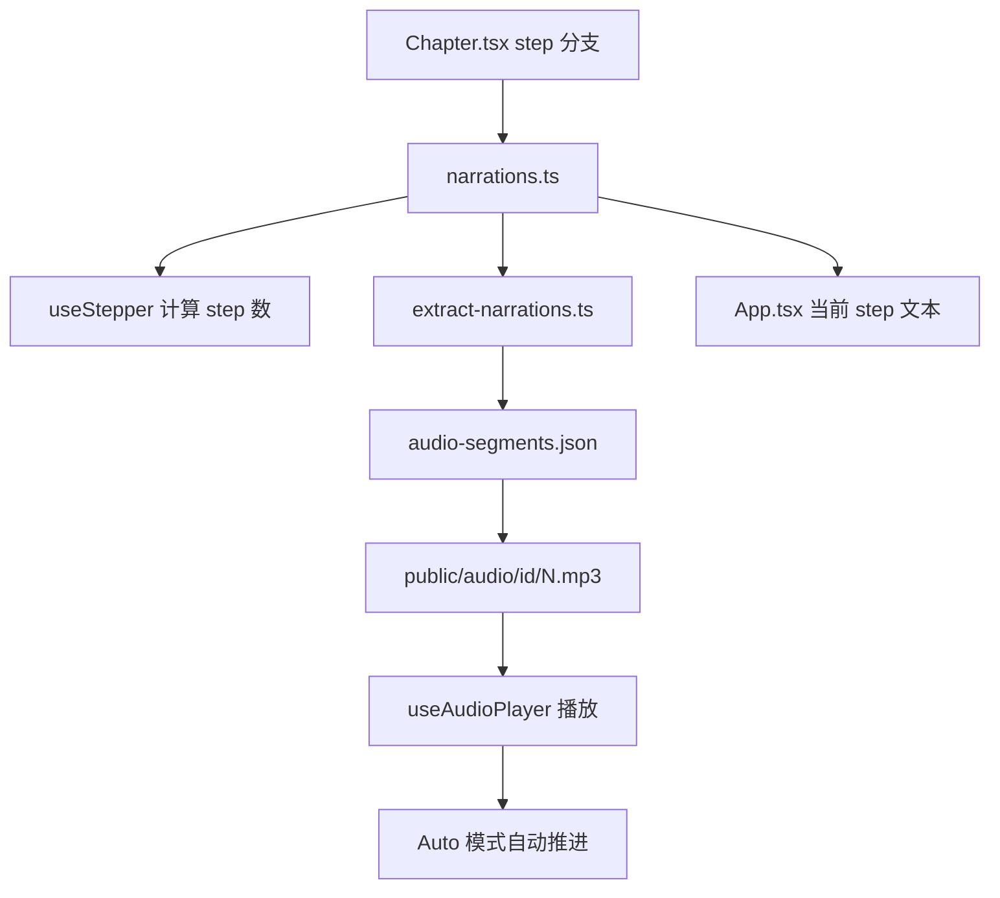

# Skill 解剖手册：`web-video-presentation`

> 来源 skill：`/Users/guwanhua/git/garden-skills/skills/web-video-presentation`
>
> 这是一份完整样板手册，用来展示 `references/HANDBOOK-FORMAT.md` 的输出形态。
> 它不是原 skill 的替代说明书；它的目标是让读者看见：一个 AI 使用这个
> skill 时，怎样被一步步约束、暂停、检查、推进，最后把文章做成可录屏的
> 网页视频。

## 这本手册怎么读

如果你只是想用这个 skill，先看"我怎样跑完一次任务"。  
如果你想理解它为什么这么设计，看"关键设计选择"。  
如果你想把招式偷到自己的 skill 里，看"能偷走的设计模式"。  
如果你想做成多页 HTML 或前端 Web App，看最后的"页面拆分建议"。

这本手册的主语是"我"：一个正在使用 `web-video-presentation` 的 AI。  
这里的"我"不是私密心理活动，而是可展示、可检查的工作轨迹：

- 我收到什么
- skill 让我读什么
- 我不能直接做什么
- 我为什么要停
- 我产出什么
- 下一步谁使用这个产物

---

## 1. 先感受它为什么 cool

这个 skill 看起来 cool 的地方，不是"它会写 React"。

真正厉害的是：我拿到一篇文章以后，不能直接冲去写网页。skill 先让我把
文章变成能念出来的 `script.md`，再把稿子变成可开发的 `outline.md`，
然后让我停在一个 checkpoint，一次和用户确认稿子、计划、主题、素材和开发
模式。确认完以后，我才进入网页开发。网页开发也不是一口气全并行，而是先
做第 1 章，让用户验收出一个风格锚点，再继续后面的章节。最后，如果用户要
自动录屏，我再从每章的 `narrations.ts` 抽出口播，合成音频，让网页按音频
一镜到底自动播放。

普通 AI 很容易把"文章做成视频"理解成：

```text
把文章切成几段 → 每段做一页大字 PPT → 加几个 fade 动画 → 结束
```

这个 skill 防的就是这件事。

它把"视频生产"拆成几个不会互相污染的阶段：

```text
文章
  → 口播节拍
  → 章节和画面计划
  → 用户对齐
  → 第一章风格锚点
  → 逐章网页开发
  → 每步口播真相源
  → 音频合成
  → 自动录屏
```

每一步都明确告诉我：现在该决定什么，不该提前决定什么。

---

## 2. 用一个小例子跑完整流程

后面所有解释都围绕这一个例子，不中途换题。

**用户输入：**

```text
我有一篇文章，讲 GPT Image 新模型的文字渲染能力。
帮我做成一个 3 分钟 B 站风格视频网页。
```

这句话里有三个关键信号：

- 用户给的是一篇文章，不是现成口播稿。
- 目标是视频网页，不是普通网页，也不是静态 PPT。
- 风格是 B 站，所以口播要能说、节奏要快、开头要抓人。

所以我不能直接写 React。我的第一步是内容编写。

---

## 3. 先看高层地图

先不要急着看文件。这个 skill 的高层逻辑是：

```text
用户意图
  "把文章做成视频"
      │
      ▼
我作为 AI 的总任务
  把"读的内容"变成"听 + 看 + 点击推进"的 16:9 网页视频
      │
      ▼
阶段拆分
  内容编写 → 用户对齐 → 网页开发 → 音频合成 → 录屏
      │
      ▼
中间产物
  article.md / script.md / outline.md / Chapter.tsx / narrations.ts
      │
      ▼
约束文件
  SCRIPT-STYLE.md / OUTLINE-FORMAT.md / CHAPTER-CRAFT.md / AUDIO.md / RECORDING.md
      │
      ▼
工程产物
  Vite + React + TS 项目 / audio-segments.json / mp3 / 可录屏网页
```

这个 skill 最核心的分工是：

```text
article.md       管原始细节
script.md        管口播节拍
outline.md       管章节计划和画面信息池
CHAPTER-CRAFT.md 管单章怎样像视频
narrations.ts    管运行时 step 数和每步口播
audio-segments   管 TTS 合成前的清单
mp3              管 Auto 模式实际播放
```

先记住这个高层分工，后面的文件就不会乱。

---

## 4. 概念先解释

### `article.md`

**人话解释：** 用户给我的原始文章。它是细节源。

**它出现在哪个场景：** 用户给我一篇公众号、博客、论文、新闻或长文，想做成
视频。

**它解决什么问题：** 防止我只依赖口播稿做画面。口播稿为了好听会压缩细节，
但画面需要数字、引用、案例、时间、对比和出处。

**我作为 AI 怎么用它：** 我先把它改写成 `script.md`，同时保留它。后面写
`outline.md` 的信息池、实现单章画面时，还要回到它里面抽细节。

**容易误解：** 生成 `script.md` 以后，`article.md` 不是废稿。它继续负责
画面信息密度。

### `script.md`

**人话解释：** 给视频用的口播节拍稿。它不是摘要，而是观众最后会听到的那条
线。

**它出现在哪个场景：** 用户给的是书面文章。文章适合读，不适合直接念。我
必须先把它改成能自然说出口的稿子。

**它解决什么问题：** 防止视频听起来像论文摘要、产品白皮书或 AI 朗读稿。

**我作为 AI 怎么用它：** 我按 `references/SCRIPT-STYLE.md` 改写原文，用
`---` 切出一个个完整想法。后面的章节切分、step 估计、`narrations.ts` 和
音频合成都受它影响。

**容易误解：** 它不是短摘要。这个 skill 明确要求信息保留度不能太低。关键
数字、案例、论证链不能被我为了"口语化"剪没。

### `outline.md`

**人话解释：** 网页开发计划。它告诉后面的章节开发：这条视频分几章，每章几
步，每一步屏幕上出现什么，每章有哪些原文细节可用。

**它出现在哪个场景：** `script.md` 生成后，我已经知道视频怎么说，但还不
知道网页怎么分章、每章多少 step、每步画面放什么重点。

**它解决什么问题：** 防止章节开发阶段一边想内容、一边想结构、一边找素材，
最后节奏混乱。

**我作为 AI 怎么用它：** 我按 `references/OUTLINE-FORMAT.md` 写章节、
step、估时、信息池和素材清单。

**容易误解：** 它不是视觉规划。它不写具体动画、CSS 手段、毫秒级动效时长。
这些要留到单章实现阶段。

### 信息池

**人话解释：** 每章从原文章里抽出的一小包可视化细节：数字、引用、案例、
时间、对比、出处。

**它出现在哪个场景：** 我写 `outline.md` 时，每章开头都要放信息池。

**它解决什么问题：** 防止网页画面只是把口播稿打在屏幕上。口播负责线性讲清，
画面要比口播多挂一点信息。

**我作为 AI 怎么用它：** 写章节时，我可以把信息池里的细节变成右下角小字、
数据浮层、pull quote、对比标签、mono cue。

**容易误解：** 信息池不是装饰素材清单。它是从 `article.md` 抽出来、能让
画面更有密度的证据和细节。

### Checkpoint Plan

**人话解释：** `script.md` 和 `outline.md` 写完后，我必须停下来和用户一次
确认 5 件事。

**它出现在哪个场景：** 内容计划完成，但还没开始写 React、CSS、动画、音频。

**它解决什么问题：** 防止我在方向没确认时进入昂贵实现，最后全部返工。

**我作为 AI 怎么用它：** 我汇报稿子、outline、主题推荐、素材需求、开发模式
选项，然后等用户确认。

**容易误解：** 它不是礼貌询问。它是成本控制点。

### 主题

**人话解释：** 一组 CSS 设计 token 和一个 `theme.json` 元数据。它决定整片
视频的颜色、字体、舞台性格和基础气质。

**它出现在哪个场景：** Checkpoint Plan 时，用户要选一个主题；脚手架时，我
把对应主题的 `tokens.css` 拷进项目。

**它解决什么问题：** 防止每章各写各的颜色和字体，最后整条视频看起来像拼贴。

**我作为 AI 怎么用它：** 颜色和字体家族必须走 token。字号、间距、动画时长
可以由章节按内容自由设计。

**容易误解：** 主题不是模板。它只兜底视觉气质，不决定每章动画怎么演。

### `CHAPTER-CRAFT.md`

**人话解释：** 单章开发时的必读规则。它告诉我怎么把一章做得像视频，而不是
像 PPT。

**它出现在哪个场景：** 每次实现一个章节时都要读，不是只在项目开头读一次。

**它解决什么问题：** 防止我把 outline 翻译成一页页文字卡片。

**我作为 AI 怎么用它：** 我按它检查：有没有视觉演示、是否逐步揭示、是否回
原文抽细节、是否避开 AI 味视觉指纹、是否写了 `narrations.ts`。

**容易误解：** 它不是美术建议。里面很多规则是验收红线，比如整章纯文字就要
重做。

### 第 1 章风格锚点

**人话解释：** 第一章不是普通章节，而是整条视频的样板间。

**它出现在哪个场景：** 主题选好、脚手架创建后，我必须先主线程完整实现第 1
章，并让用户验收。

**它解决什么问题：** 防止后面并行或批量开发前，风格和质量标准还没被真实
页面验证。

**我作为 AI 怎么用它：** 第 1 章必须一次到位：真节奏、真视觉、真素材或明确
placeholder，不能先做骨架版糊弄过去。

**容易误解：** 第 1 章不是为了让后面章节视觉完全一致。它是代码和气质参考，
不是抄袭对象。

### `narrations.ts`

**人话解释：** 每章每个 step 对应的口播文本数组。它是运行时 step 数和音频
合成的最终真相源。

**它出现在哪个场景：** 每章实现时，和 `<Chapter>.tsx` 放在同一个章节目录。

**它解决什么问题：** 防止网页 step、口播文本、音频文件数各自漂移，导致
Auto 模式录屏错位。

**我作为 AI 怎么用它：** 数组长度必须等于章节代码里 step 的数量。每条文本
语义要对应 `script.md`，可以为 TTS 微调标点，但不能漏关键短语。

**容易误解：** `outline.md` 不是最终 step 真相源。真实实现阶段可以调整 step，
最后以 `narrations.ts` 为准。

### `audio-segments.json`

**人话解释：** TTS 合成前的扁平清单。它告诉合成脚本：哪一章第几步要合成
哪段文本，输出到哪个 mp3。

**它出现在哪个场景：** 用户选择合成音频后，我运行 `npm run extract-narrations`。

**它解决什么问题：** 防止 TTS 脚本直接读散落的章节文件，难以检查、难以续跑。

**我作为 AI 怎么用它：** 生成后先让用户扫一眼，确认文本和切分对，再烧 token
合成音频。

**容易误解：** 它不是手写文件。它从 `narrations.ts` 抽取生成。

### Auto 模式

**人话解释：** 自动播放和自动推进的录屏模式。打开 `?auto=1` 后，按一次 Space，
网页会按每段音频播完后自动进入下一步。

**它出现在哪个场景：** 音频已经合成，用户要一镜到底录屏。

**它解决什么问题：** 不需要手动点鼠标，也不需要后期对音轨。

**我作为 AI 怎么用它：** 我必须提前保证每个 step 的视觉动画不长于对应口播。
因为 Auto 模式不等动画，只等音频结束。

**容易误解：** Auto 模式不是录屏软件。它只是让网页按音频节奏自己推进。

---

## 5. 我怎样跑完一次任务

### 5.1 我先判断用户给了什么

**从这里开始：** 我刚拿到用户输入，还没动手做任何事。skill 第一件事让我先停一拍，判断用户给的原料是什么——而不是马上写代码。

我现在拿到的是一篇文章和目标："做成 3 分钟 B 站风格视频网页"。

skill 先让我判断输入类型：

| 用户给的东西 | 我该做什么 |
|---|---|
| 原始文章 | 生成 `script.md` + `outline.md` |
| 现成口播稿 | 落盘成 `script.md`，再生成 `outline.md` |
| 只有主题 | 反问用户先提供素材或大纲 |

这个例子里，用户给的是文章，所以我进入内容编写。

我不能直接写网页。因为文章是给人读的，网页视频是给人听和看的。直接写网页
会把文章变成几页大字 PPT。

**我产出：** 路由判断：先生成 `script.md` 和 `outline.md`。  
**下一步谁用它：** 内容编写阶段。  
**这里能偷的招：** 入口分流。先判断用户给的原料是什么，再决定流程。

**下一步靠这个：** 用户给的是文章不是口播稿，所以下游每一步的活都得在我手里现造。下一步要先把"读的"转成"能念的"——不然后面网页的节奏会建在我脑补的口播速度上。

### 5.2 我生成 `script.md`

**接上一步：** 我已经判断清楚用户给的是文章不是稿子，所以这一步避不掉——不能从口播稿 skip 进来。

我现在拿到的是 `article.md`。skill 要我读 `references/SCRIPT-STYLE.md`。

这个文件约束我把书面文章改成能念出来的口播稿。它有两个底线：

- 信息保留度不能太低。
- 必须去 AI 味。

坏场景是：我为了让稿子"口语化"，把事实、数字、案例、论证链剪掉，只剩几句
漂亮总结。观众听起来轻松，但文章真正的信息没有了。

所以我写 `script.md` 时要同时满足：

```text
能说出口
  但不是空泛口播
信息还在
  但不是书面朗读
```

例子：

```text
原文：
该模型在文字渲染方面取得显著提升，复杂海报场景下仍存在局部错误。

口播稿：
文字这块确实变强了。
以前一张海报里只要有中文，基本就露馅。
现在不一样了。
但复杂场景下，它还不是完全稳。
```

我还要用 `---` 切出节拍：

```markdown
文字这块确实变强了。

---

以前一张海报里只要有中文，基本就露馅。

---

现在不一样了。
```

这些 `---` 后面会影响 step 切分。

**我产出：** `script.md`。  
**下一步谁用它：** `outline.md` 用它切章节和 step；后面的 `narrations.ts`
用它保持口播语义。  
**这里能偷的招：** 先把原始材料转成执行格式，再让后续阶段吃这个格式。

**下一步靠这个：** 稿子的节奏稳了。但为了好念，原文里的数字、案例、引用被压缩了一批——这些后面要用在画面上。下一步必须先把原文守住，别让它被当成废稿删掉。

### 5.3 我保留 `article.md`

**接上一步：** 上一步改稿子时，我为了"能念"压缩了不少书面细节。这一步表面上不动手做新东西——但如果不在这里明确保留原文，那些细节就再也回不来了。

我已经生成了 `script.md`，但 skill 不让我删掉 `article.md`。

原因很简单：

```text
script.md   管什么时候说什么
article.md  管画面能挂多少细节
```

口播稿为了好听，会压缩细节。网页画面却需要细节：数字、引用、案例、时间、
对比、出处、小标签。不能靠我现编。

```text
article.md
  ├── 改写成能念的稿子 ──► script.md       管节奏
  └── 抽取画面细节 ─────► 信息池           管画面密度
```

坏场景是：我只用 `script.md` 做画面，最后屏幕等于把口播打字打了一遍。

**我产出：** 不是新文件，而是保留一个源。  
**下一步谁用它：** `outline.md` 的信息池、每章实现时的画面细节。  
**这里能偷的招：** 两个后续阶段需要不同信息时，不要让一个中间文件吞掉全部
职责。

**下一步靠这个：** 现在我手上一份管节奏、一份管细节。下一步写 outline 时，信息池能直接从原文抽证据——而不是从一份被压缩过的稿子里挤。

### 5.4 我生成 `outline.md`

**接上一步：** 上一步我留下了 `article.md`。所以这一步写 outline 时，每章信息池能直接从原文抽数字、引用、案例。如果上一步把原文删了，这一步我就只能现编——风险很高。

我现在有 `script.md` 和 `article.md`。skill 要我读
`references/OUTLINE-FORMAT.md`。

我写 `outline.md` 时要决定：

- 分几章。
- 每章几个 step。
- 每步屏幕上出现什么。
- 每章有哪些信息池。
- 素材清单里有哪些已就位、哪些缺失。

但我不能写：

- 具体动画名。
- CSS 实现手段。
- blur / wipe / spring 这种效果指令。
- 毫秒级动效时长。

看起来这像少写了一半。为什么不一次规划完？

坏场景是：我在信息还不够时提前写死动画，后面的章节开发只能机械执行。
比如 outline 里写死"这里用 blur clear"，但真正实现时这一章更适合做
文字被切开、对比条增长或终端输出。上游的猜测反而限制了下游。

所以 `outline.md` 只做它该做的事：

```text
节奏
内容
信息密度
```

视觉动作留到章节实现时，由 `CHAPTER-CRAFT.md` 和当前主题共同约束。

**我产出：** `outline.md`。  
**下一步谁用它：** Checkpoint Plan 给用户看；章节开发用它开工。  
**这里能偷的招：** 上游不要抢下游判断权。

**下一步靠这个：** 现在稿子、outline、信息池都在手里，但都还是文本。下一步是返工成本最低的一刻——再往后每改一次都贵。所以下一步必须停。

### 5.5 我先自检，再进入 Checkpoint Plan

**接上一步：** 上一步我同时产出了 `script.md` 和 `outline.md`，本能想立刻交给用户。但产出和过检是两件事——如果我把"完成了"当成"可以汇报"，自检就只是装饰。

写完 `script.md` 和 `outline.md` 后，skill 不允许我直接汇报"完成了"。

我必须先自检：

- `script.md` 按 `SCRIPT-STYLE.md` 检查信息保留、口语化、去 AI 味、念出来。
- `outline.md` 按 `OUTLINE-FORMAT.md` 检查 step、信息池、素材清单、估时。

如果自检发现 fail，我不能把 fail 原样转述给用户。我必须先修。

坏场景是：AI 把自检当成报告装饰，告诉用户"我检查出三个问题"，但产物本身
没有改。

**我产出：** 自检通过后的 `script.md` 和 `outline.md`。  
**下一步谁用它：** Checkpoint Plan。  
**这里能偷的招：** 检查必须接修复，否则只是仪式。

**下一步靠这个：** 自检过的版本才能进 checkpoint。下一步用户看到的是"通过版"，所以他能专心判断方向，不用替我抓低级错。

### 5.6 我停在 Checkpoint Plan

**接上一步：** 上一步我把自检暴露的问题自己改了。所以这一步我能把一份过了的稿子和 outline 一起摆出来——让用户一次看完，而不是边读边帮我抓错字。

我现在手上有 `script.md` 和 `outline.md`。按默认 AI 冲动，我会想马上开写
网页。

skill 把我拦住。

因为现在所有东西还都是文本：

- 稿子不对，改 `script.md`。
- 章节切错，改 `outline.md`。
- 主题不合适，换 theme。
- 素材缺失，用户补或先 placeholder。
- 开发方式不确定，先选逐章、顺序还是并行。

这些现在改都便宜。等 React、CSS、动画、音频都写完，再改就贵。

所以我必须一次让用户确认 5 件事：

```text
1. 稿子
2. outline
3. 主题
4. 素材
5. 开发模式
```

我还要动态读 `themes/*/theme.json`，根据 `bestFor`、`descriptionZh` 和
内容类型主动推荐 2-3 个主题，而不是硬编码主题清单。

开发模式也要让用户选：

| 模式 | 适合什么 |
|---|---|
| 逐章确认 | 风险最低，每章都验收 |
| 第 1 章后顺序开发 | 速度中等，不并行 |
| 第 1 章后并行开发 | 最快，但章节风格会有差异 |

**我产出：** 用户确认后的方向：稿子、outline、主题、素材策略、开发模式。  
**下一步谁用它：** Phase 2 网页开发。  
**这里能偷的招：** 在昂贵工作开始前，设置一次多项对齐 checkpoint。

**下一步靠这个：** 用户点头后，我才进入贵的阶段——React、CSS、动画、音频。下一步不让我手写项目结构，因为这种活漏接一两根线就要返工。

### 5.7 我用脚手架创建项目

**接上一步：** 上一步用户确认的是方向（稿子、outline、主题、素材、模式）。所以这一步我能直接跑脚本——主题、stepper、音频接线、模式切换不用每条都问。

用户确认主题后，我进入 Phase 2.1。skill 让我运行脚手架：

```bash
bash scripts/scaffold.sh ./presentation --theme=<theme-id>
```

脚手架不是这个 skill 最聪明的地方，但它承担了一个重要职责：把容易接错的
项目结构一次性搭好。

它会创建：

- Vite + React + TS 项目。
- 16:9 舞台。
- stepper。
- 隐藏进度条。
- Auto / Audio / Manual 模式。
- active theme 的 `tokens.css`。
- 示例章节。
- 音频抽取和合成脚本。

它还会跑一次 typecheck，避免脚手架刚落地就坏。

坏场景是：每次都让 AI 手写项目结构，极易漏接音频、进度条、主题 token 或
stepper。

**我产出：** `presentation/` 项目。  
**下一步谁用它：** 第 1 章开发。  
**这里能偷的招：** 把脆弱、重复、容易漏的工程接线放进脚本。

**下一步靠这个：** 项目壳稳了，但所有章节都是占位。下一步我不能并行开 N 章——必须先做透一章，让用户在最便宜的位置否决一次风格。

### 5.8 我先做第 1 章

**接上一步：** 上一步脚手架替我接好了 stepper、音频、主题、模式切换。所以这一步我能把全部精力放在"内容长什么样、节奏怎么走"，不用分心修运行时管线。

项目建好后，我仍然不能把所有章节并行扔出去。

skill 要我先主线程完整实现第 1 章，并停下来让用户验收。

第 1 章的作用不是"先做一个简单 demo"。它是风格锚点：

- 主题是否合适，会在第 1 章暴露。
- 字号、留白、节奏是否舒服，会在第 1 章暴露。
- `CHAPTER-CRAFT.md` 是否有盲区，会在第 1 章暴露。
- 后续章节的代码结构，会参考第 1 章。

如果第 1 章不对，只改一章。  
如果全部写完才发现不对，就要改很多章。

我验收时要提醒用户看：

- 视觉气质对不对。
- 节奏对不对。
- 动画是不是内容驱动。
- 画面有没有从 `article.md` 挂额外细节。
- 有没有紫粉渐变、圆角彩色边框、emoji、假插画等 AI 味。

**我产出：** 完整第 1 章。  
**下一步谁用它：** 用户验收；后续章节参考它的代码风格。  
**这里能偷的招：** 批量开发前，先做透一个真实样本。

**下一步靠这个：** 第 1 章被用户点头之后，后面章节的视觉气质、节奏标准、代码风格才有参照。下一步才有资格批量做。

### 5.9 我逐章开发第 2 到第 N 章

**接上一步：** 上一步第 1 章已经被用户校准过。所以这一步每章都能对照一个真实样本——不用每章和用户重谈一次审美。

第 1 章通过后，我根据用户选的模式继续：

- 逐章确认：每章做完都停。
- 顺序开发：主线程做完剩余章节再统一验收。
- 并行开发：用 subagent 做剩余章节，风格差异是预期。

无论哪种模式，每章都必须按 `CHAPTER-CRAFT.md` 开发。

我不能把 outline 翻译成文字页。我每章都要问：

```text
这一步到底在演什么？
这个信息能不能用图形、对比、增长、切换、连线、聚光来表现？
清单是不是逐项揭示？
画面有没有回 article.md 抽额外细节？
这一章有没有至少 1-2 处 CSS / SVG / Canvas / JS 视觉演示？
```

坏场景是：所有 step 都只是文字 fade in，观众看到的是动态 PPT。

**我产出：** 每章的 `<Chapter>.tsx`、`<Chapter>.css`、`narrations.ts`。  
**下一步谁用它：** 注册表、stepper、音频抽取脚本、Auto 模式。  
**这里能偷的招：** 把"审美要求"写成验收不过的失败条件。

**下一步靠这个：** 章节越写越多，step 数、口播文本、音频段三方现在都在各自地方记账。下一步必须立一个最终真相源——不然运行时会漂，录屏一定错位。

### 5.10 我把 `narrations.ts` 当成最终真相源

**接上一步：** 上一步我把所有章节写完了。但 outline 里的 step 数、代码里的 step 数、音频段数三方在各自声明同一件事。这一步不钉真相源，下面的录屏一定错位。

每章实现时，我必须写 `narrations.ts`。

它的数组长度就是该章 step 数。运行时的 `CHAPTERS` 注册表读取每章
`narrations`，`useStepper` 用它算 step 总数，`extract-narrations.ts` 用它
生成 TTS 段落，`App.tsx` 用当前 step 的 narration 找对应音频。

```text
Chapter.tsx
  step 0 / step 1 / step 2
        │ 必须一一对应
        ▼
narrations.ts
  [口播0, 口播1, 口播2]
        │
        ├── useStepper          决定 step 数
        ├── extract-narrations  生成 audio-segments.json
        └── App / useAudio      播放 / 自动推进
```

为什么不让 `outline.md` 当最终真相源？

因为 outline 是计划，真实实现会变。  
实现阶段可能把一个 step 拆成两个，或者为了音频节奏合并某些画面。  
离运行时最近的 `narrations.ts` 才应该当真。

**我产出：** 每章 `narrations.ts`。  
**下一步谁用它：** stepper、音频抽取、Auto 模式。  
**这里能偷的招：** 当计划和运行会漂时，让离运行最近的文件当最终真相源。

**下一步靠这个：** 现在 step 数和口播文本一一对应在 `narrations.ts` 里。下一步可以进音频——但音频是昂贵动作，不能擅自开始。

### 5.11 我完成网页后停在 Checkpoint Audio

**接上一步：** 上一步 `narrations.ts` 已经钉成真相源，意味着只要用户说合成，TTS 不会再有文本歧义。

网页做完后，我不能默认合成音频。

skill 要我停下来问用户是否合成：

```text
要不要合成音频做自动播放录屏？
```

如果用户说不合成，就走手动录屏 + 后期配音。  
如果用户说合成，我才进入 Phase 3。

坏场景是：我擅自调用 TTS，烧 token、耗时、还可能用错音色或用户根本不需要。

**我产出：** 音频路线选择。  
**下一步谁用它：** Phase 3 或 Phase 4。  
**这里能偷的招：** 昂贵或外部依赖动作前，再设一个小 checkpoint。

**下一步靠这个：** 用户如果说合成，下一步我也不会直接调 TTS——先生成一份可审阅清单，让 token 烧之前再过最后一道便宜的关。

### 5.12 我从 `narrations.ts` 抽取音频段

**接上一步：** 上一步用户明确说要合成。所以这一步我不是"试着合成看看"——直接生成扁平清单，让用户在烧 token 之前最后扫一眼。

用户选择合成音频后，我运行：

```bash
npm run extract-narrations
```

这个脚本读取 `src/registry/chapters.ts` 的章节顺序，再动态读取每章的
`narrations.ts`，生成 `audio-segments.json`：

```json
[
  { "chapter": "coldopen", "step": 1, "text": "...", "audio": "coldopen/1.mp3" }
]
```

我还要让用户先扫一眼这个 JSON。确认文本和切分对，再合成。

坏场景是：直接合成，结果发现某段文本错、切分错、音频文件名错，TTS token
已经烧掉。

**我产出：** `audio-segments.json`。  
**下一步谁用它：** `synthesize-audio.sh`。  
**这里能偷的招：** 外部昂贵调用前生成可审阅清单。

**下一步靠这个：** 清单过了，下一步才能合成音频。这是最后一道便宜的关——再往后烧的就是真 token。

### 5.13 我合成音频

**接上一步：** 上一步用户已经扫过 `audio-segments.json`。所以这一步烧 TTS 时，出错只会是工具或音色问题，不会是文本错——文本错的话上一步就拦下了。

默认路线是 MiniMax CLI：

```bash
npm run synthesize-audio
```

脚本按 `audio-segments.json` 串行合成每段 mp3，输出到：

```text
public/audio/<chapter-id>/<step-N>.mp3
```

它会跳过已存在文件，所以中断后可以续跑。  
如果本机没有 `mmx-cli`，我不能假装合成成功。skill 要我问用户换哪种 TTS
或是否跳过。

合成完后，我要关注过长音频。比如单段 ≥ 15 秒，可能意味着这个 step 太密，
需要拆 step 或重写 narration。

**我产出：** 每 step 一个 mp3。  
**下一步谁用它：** Auto 模式播放。  
**这里能偷的招：** 外部工具默认增量执行，失败时明确退化路径。

**下一步靠这个：** 音频按 `narrations.ts` 的顺序落盘了。下一步要让网页按这些音频自己跑——这就意味着运行时只能有一个时钟，不能让动画和音频抢推进权。

### 5.14 我进入录屏流程

**接上一步：** 上一步音频已经落地，每段音频对应 `narrations.ts` 里的一条文本、`Chapter.tsx` 里的一个 step。三方对齐了，所以网页在 Auto 模式下自己推进时不会错位。

如果音频已合成，推荐路线是 Auto 模式一镜到底：

```text
打开 http://localhost:5173/?auto=1
浏览器全屏
开始录屏
按一次 Space
网页自动播放音频并推进 step
结束后裁头尾
```

这里最重要的规则是：

```text
Auto 模式等音频结束，不等动画结束。
```

所以如果某个视觉动画比口播长，它会被切断。解决方式只有三种：

- 写更长口播。
- 拆 step。
- 调快动画。

坏场景是：章节里写了一个 5 秒动画，但 narration 只有 2 秒，录屏时动画演到
一半就跳下一步。

**我产出：** 可录屏网页路径和录制建议。  
**下一步谁用它：** 用户录屏和剪辑。  
**这里能偷的招：** 让运行时规则简单到可预测，别给每个动画再加一套隐藏调度。

**这里把账结清：** 前面 13 步每次"被按住"的憋屈，到这一步全部还回来——我闭眼按一次 Space，网页自己跑完。因为前面把每一个会漂的源都钉死了。

---

## 6. 文件角色图

```text
article.md
  原始细节源
  ├── script.md      从它改写口播
  └── outline 信息池  从它抽画面细节

script.md
  口播节拍源
  └── outline.md     用它切章节和 step

outline.md
  开发计划
  └── Chapter.tsx    用它知道每步屏幕上有什么

CHAPTER-CRAFT.md
  单章开发规则
  └── Chapter.tsx / CSS / narrations.ts

narrations.ts
  运行时真相源
  ├── useStepper
  ├── extract-narrations.ts
  ├── audio-segments.json
  └── public/audio/<id>/<N>.mp3
```

### `SKILL.md`

**谁读取它：** 使用这个 skill 的 AI。

**它管什么：** 总工作流、硬节点、阶段顺序、何时读哪些 reference。

**它不管什么：** 每章具体视觉动作。那是 `CHAPTER-CRAFT.md` 管。

**如果它写错会怎样：** AI 会跳过 checkpoint、读错 reference、或者在错误
阶段做太多决定。

### `references/SCRIPT-STYLE.md`

**谁读取它：** Phase 1.2 生成 `script.md` 时的我。

**它管什么：** 文章如何变成能念出来的口播稿；信息保留度；去 AI 味。

**它不管什么：** 网页画面、章节动画、主题。

**如果它写错会怎样：** 稿子会像 AI 朗读稿，或者变成短摘要，后面所有节奏
都会失真。

### `references/OUTLINE-FORMAT.md`

**谁读取它：** Phase 1.2 生成 `outline.md` 时的我。

**它管什么：** 章节格式、step 格式、信息池、素材清单、估时。

**它不管什么：** 具体动画和 CSS 实现。

**如果它写错会怎样：** 章节开发拿到的计划要么太空，要么过早写死视觉方案。

### `references/CHAPTER-CRAFT.md`

**谁读取它：** 每次实现单章时的我。

**它管什么：** 视频感、逐步揭示、双源原则、反 AI 味视觉、代码红线、自检。

**它不管什么：** 整个项目的阶段分流；那由 `SKILL.md` 管。

**如果它写错会怎样：** 章节会退化成 PPT，或者运行时 step / 音频错位。

### `themes/<id>/theme.json`

**谁读取它：** Checkpoint Plan 推荐主题时的我。

**它管什么：** 主题名称、中文描述、适合场景、mood。

**它不管什么：** 实际 CSS token 值；那在 `tokens.css`。

**如果它写错会怎样：** 我会推荐不匹配的主题，或者无法解释为什么推荐。

### `themes/<id>/tokens.css`

**谁读取它：** 脚手架复制到项目；章节 CSS 通过 CSS variables 消费。

**它管什么：** 颜色、字体家族、舞台性格、primitive class 的视觉签名。

**它不管什么：** 每章的具体构图、字号、动画时长。

**如果它写错会怎样：** 换主题破，或者整条视频气质不统一。

### `templates/src/registry/chapters.ts`

**谁读取它：** 运行时 `App`、`useStepper`、`extract-narrations.ts`。

**它管什么：** 章节顺序、章节 id、组件、每章 narration 数组。

**它不管什么：** 每个 step 画面怎么渲染。

**如果它写错会怎样：** 章节顺序错、音频目录错、step 总数错。

### `templates/src/hooks/useStepper.ts`

**谁读取它：** React 运行时。

**它管什么：** 当前章节和 step、前进后退、全局 step index、本地持久化游标。

**它不管什么：** 音频播放；那由 `useAudioPlayer` 管。

**如果它写错会怎样：** 点击推进错位，或者旧游标落到不存在的 step 上。所以
章节结构大改后要 bump `STORAGE_KEY`。

### `templates/src/hooks/useAudioPlayer.ts`

**谁读取它：** React 运行时。

**它管什么：** 每 step 音频播放、播放结束后是否自动推进、缺音频时按字数
估时退化。

**它不管什么：** 动画是否完成。它故意不等动画。

**如果它写错会怎样：** 自动录屏节奏不可预测。

### `scripts/scaffold.sh`

**谁运行它：** Phase 2.1 的我。

**它管什么：** 创建 Vite 项目、复制模板、复制主题、接音频脚本、跑 typecheck。

**它不管什么：** 写真实章节。

**如果它写错会怎样：** 每个项目从第一步就不可靠。

---

## 7. 关键设计选择

### 7.1 一次产出 `script.md` + `outline.md`

**看起来多此一举的地方：** 为什么不先写 `script.md`，让用户确认，再写
`outline.md`？

**坏场景：** checkpoint 太多，用户被迫分两次确认内容层面的东西；同时
`outline.md` 只依赖稿子节拍和原文信息池，不需要等另一次用户确认才能草拟。

**skill 怎么约束我：** Phase 1.2 要在同一次思考里产出 `script.md` 和
`outline.md`，之后一起进入 Checkpoint Plan。

**解决的问题：** 减少协作中断，同时让用户在一个节点看到完整内容计划。

**可偷的招：** 把同一成本层级的产物合并到一个 checkpoint 前完成。

### 7.2 保留 `article.md`

**看起来多此一举的地方：** 已经有口播稿了，为什么还要保留原文？

**坏场景：** 后面做画面时，只能从口播稿拿信息，导致画面只是字幕化复述；
或者 AI 为了增加画面细节现编数字和案例。

**skill 怎么约束我：** 明确写出 `article.md` 不删，并让 outline 信息池和
章节实现回原文抽细节。

**解决的问题：** 让画面信息密度高于口播信息密度，同时避免假数据。

**可偷的招：** 不同决策维度保留不同源。

### 7.3 `outline.md` 不写动画

**看起来多此一举的地方：** 为什么不一次把动画也规划好？

**坏场景：** 我在信息还不够时提前写死动画，章节开发只能照着翻译，失去内容
驱动判断。

**skill 怎么约束我：** outline 只写节奏、内容、信息池，不写动画类型、CSS
实现、毫秒级时长。

**解决的问题：** 把视觉判断留给真正掌握章节上下文的阶段。

**可偷的招：** 上游不抢下游判断权。

### 7.4 Checkpoint Plan 一次对齐 5 件事

**看起来多此一举的地方：** 为什么不让用户只确认稿子，其他我自己选？

**坏场景：** 稿子对了，但主题不合适；outline 对了，但素材缺；素材有了，但
开发模式不符合用户期待。任何一个错了，进入开发后都很贵。

**skill 怎么约束我：** 在内容计划后必须停，确认稿子、outline、主题、素材、
开发模式。

**解决的问题：** 把方向性决定放在返工成本最低的时候做。

**可偷的招：** 昂贵阶段前的一次多项对齐。

### 7.5 第 1 章必须主线程完整做完

**看起来多此一举的地方：** 如果后面能并行，为什么第 1 章不能也并行？

**坏场景：** 没有真实样本校准时，多个 agent 同时写章节，最后每章都像不同
项目，或者一起踩同一个主题 / 规则问题。

**skill 怎么约束我：** 第 1 章主线程做，完整版本，用户验收，不可跳过。

**解决的问题：** 用一个真实章节暴露风格、主题、代码和指引问题。

**可偷的招：** 先做透一个样本，再放手批量。

### 7.6 每章都读 `CHAPTER-CRAFT.md`

**看起来多此一举的地方：** 读一次不就记住了吗？

**坏场景：** 长会话里我会遗忘原则，尤其写第 5、6、7 章时，很容易回到默认
网页卡片和文字堆叠。

**skill 怎么约束我：** Phase 2.4 每章都把 `CHAPTER-CRAFT.md` 作为单一必读
入口。

**解决的问题：** 重复阶段不会因为上下文疲劳而降级。

**可偷的招：** 对重复执行的高风险阶段，设置每次必读的单一入口。

### 7.7 `narrations.ts` 是最终真相源

**看起来多此一举的地方：** `script.md` 和 `outline.md` 已经有文本和 step，
为什么还要每章一个 narration 文件？

**坏场景：** 计划写 5 步，真实代码写 6 步，音频合成 4 段，录屏时全部错位。

**skill 怎么约束我：** 每章必须有 `narrations.ts`，数组长度等于真实 step
数，运行时和音频都从它读。

**解决的问题：** 根除 step 数和音频文件数对不上的漂移。

**可偷的招：** 离运行时最近的文件当真相源。

### 7.8 Auto 模式不等动画

**看起来多此一举的地方：** 为什么不让系统等动画结束再推进？

**坏场景：** 如果每个动画都能影响推进时机，整片节奏会变成隐藏状态机，调试
困难，录屏不可预测。

**skill 怎么约束我：** Auto 模式只按音频结束 + 200ms 推进。动画必须适配
口播时长。

**解决的问题：** 运行规则简单、稳定、可预测。

**可偷的招：** 自动化流程中选择一个主时钟，不要让多个时钟抢控制权。

---

## 8. 能偷走的设计模式

### 8.1 原料分流 · 状态：候选

**它防什么坏结果：** 所有用户输入都走同一套流程，导致没有内容时 AI 也硬编，
有口播稿时又重复改写。

**场景例子：** 原始文章、现成口播稿、空主题三种入口走不同路径。

**怎么复用：** skill 开头先列输入类型表，明确每种输入要做什么、不能做什么。

**反例：** 只在描述里说"支持多种输入"，但没有路由规则，不是这招。

**代价：** 入口越多，维护越复杂。只列真实需要支持的入口。

### 8.2 双源分工 · 状态：候选

**它防什么坏结果：** 一个中间文件吞掉全部职责，导致后续阶段缺细节或节奏。

**场景例子：** `script.md` 管口播节奏，`article.md` 继续管画面细节。

**怎么复用：** 当源材料要服务两个不同维度时，保留两个源，并明确每个源管
什么。

**反例：** 简单备份原文但后续从不读取，不是这招。

**代价：** 后续阶段要记得读两个源，文档必须把边界写清楚。

### 8.3 上游不抢下游判断权 · 状态：候选

**它防什么坏结果：** 早期计划写死后期实现细节，让后面的 agent 退化成翻译机。

**场景例子：** `outline.md` 不写动画，只写节奏、屏幕内容、信息池。

**怎么复用：** 每个中间产物只写当前阶段有足够信息能决定的事。需要现场上下文
的决定留给下游。

**反例：** 上游什么都不写，让下游猜，也不是这招。上游仍要给清楚边界。

**代价：** 下游 agent 需要更强判断力，必须有独立规则文件兜底。

### 8.4 便宜返工点 checkpoint · 状态：候选

**它防什么坏结果：** AI 太快进入昂贵实现，方向错了才发现。

**场景例子：** `script.md` + `outline.md` 完成后停在 Checkpoint Plan。

**怎么复用：** 在文本计划进入代码实现、批量生成、外部 API 调用之前，设置
一次必须暂停的确认点。

**反例：** 每做一点都问用户，不是这招。那会让流程变慢。

**代价：** 多一次用户确认，但换来更低的返工风险。

### 8.5 风格锚点 · 状态：候选

**它防什么坏结果：** 批量开发前没有真实样本，导致整体方向跑偏。

**场景例子：** 第 1 章必须主线程完整做完并验收。

**怎么复用：** 大批量内容生成、并行开发、设计系统应用前，先做一个真实完整
样本。

**反例：** 先做一个低保真骨架，不是这招。锚点必须能暴露真实质量问题。

**代价：** 前期速度变慢，但能减少大面积返工。

### 8.6 单一必读入口 · 状态：候选

**它防什么坏结果：** 重复阶段中，AI 每次记住一部分规则，忘掉另一部分。

**场景例子：** 每章实现只读 `CHAPTER-CRAFT.md` 这个单一入口，里面合并原则、
五问、工具箱、反模式、代码红线、自检。

**怎么复用：** 对重复执行且容易降级的阶段，把关键规则合到一个必读入口。

**反例：** 把规则散在 8 个 reference 里，然后说"按需读取"，不是这招。

**代价：** 单一入口会变长，需要结构清晰。

### 8.7 运行时真相源 · 状态：候选

**它防什么坏结果：** 计划、代码、音频各自声明同一件事，最后漂移。

**场景例子：** `narrations.ts` 同时决定 step 数和音频合成文本。

**怎么复用：** 当多个文件会描述同一运行事实时，让离运行最近的文件当最终
真相源。

**反例：** 永远以最早的规划文档为准，不是这招；真实实现会变。

**代价：** 需要说明哪些上游文件允许滞后，以及何时要同步回来。

### 8.8 审阅清单接修复 · 状态：候选

**它防什么坏结果：** 自检变成汇报材料，而不是质量闭环。

**场景例子：** `script.md`、`outline.md`、单章实现都要求自检 → 修复 → 再汇报。

**怎么复用：** 每个检查点都写明：拿到 fail 后先修，不允许只把问题转述给用户。

**反例：** 写一堆 checklist，但没有"fail 后必须修"规则，不是这招。

**代价：** 交付前会多一轮修改，但输出更稳定。

### 8.9 主时钟原则 · 状态：候选

**它防什么坏结果：** 自动流程里多个时钟抢控制权，行为不可预测。

**场景例子：** Auto 模式只按音频结束推进，不等动画完成。

**怎么复用：** 自动化系统里先选一个主时钟，比如音频、事件流、测试结果或
队列状态，其它行为都对齐它。

**反例：** 让音频、动画、用户点击、定时器都能推进，不是这招。

**代价：** 其它维度必须主动适配主时钟。这里就是动画适配口播。

---

## 9. 如果我要写类似 skill

这个 skill 给出的不是"视频网页模板"，而是一种拆复杂生成任务的方法。

你可以这样抄：

### 9.1 先问：原始输入不能直接喂给最终生成吗？

如果不能，中间必须有执行格式。

在这里：

```text
文章不能直接喂给网页开发
→ 先转成 script.md
→ 再转成 outline.md
```

写别的 skill 时也一样：

```text
用户想要研究报告
→ 原始资料不能直接喂给报告
→ 先转成证据表 / 观点候选 / 结构大纲
```

### 9.2 再问：哪些阶段需要不同真相源？

在这里：

```text
script.md 管节奏
article.md 管细节
narrations.ts 管运行时 step
```

不要把所有责任塞进一个文件。

### 9.3 找出最便宜的返工点

在这里，最便宜的返工点是 `script.md` 和 `outline.md` 刚写完，还没开始写
网页。

所以 checkpoint 放在那里。

别的 skill 也要找这个点：

```text
还没调用 API 前
还没批量生成前
还没写数据库前
还没并行分发前
```

### 9.4 重复阶段要有单一入口

在这里，重复阶段是"实现单章"。  
所以它有 `CHAPTER-CRAFT.md`。

如果你的 skill 有重复阶段，比如：

- 每个章节
- 每个客户
- 每个文件
- 每个页面
- 每个测试场景

那就给它一个单一必读入口，避免 AI 越做越松。

### 9.5 最后问：运行时谁当真？

在这里，`narrations.ts` 当真，因为它离运行时最近。

别的 skill 也要明确：

```text
计划文件当真？
代码当真？
配置当真？
数据库当真？
生成清单当真？
```

不说清楚，文件迟早会漂。

---

## 10. Visual Assets Plan

这本手册应该配图，但不要把所有图都交给生图。  
精确关系图用 Mermaid / SVG / HTML/CSS；概念氛围图才用 imagegen。

判断标准很简单：

```text
如果图错一个箭头就会误导读者 → 用代码画
如果图的作用是让读者产生感受和记忆 → 用 imagegen
```

### 10.1 `flow-overview.mmd`

**用途：** 放在"高层地图"后面，让读者一眼看到整条视频生产线。

**类型：** Mermaid。

**为什么用这种类型：** 这是精确流程图，阶段和箭头必须可维护。

**图内容：**


**避免：** 不要用 imagegen 画这张图。它需要准确文件名和箭头。

### 10.2 `dual-source-principle.svg`

**用途：** 解释 `script.md` 和 `article.md` 的双源分工。

**类型：** SVG 或 HTML/CSS。

**为什么用这种类型：** 文件名、职责和箭头必须准确，但可以做得美观。

**图内容：**

```text
article.md
  ├── 改写成能念的稿子 ──► script.md ──► 口播节奏 / step 顺序
  └── 抽取原文细节 ─────► 信息池 ─────► 画面密度 / 数据 / 引用
```

**避免：** 不要把它画成抽象双路河流却没有文件责任；那会好看但没用。

### 10.3 `narrations-truth-source.mmd`

**用途：** 解释为什么 `narrations.ts` 是运行时最终真相源。

**类型：** Mermaid。

**为什么用这种类型：** 它连接代码、音频、自动播放，必须表达准确。

**图内容：**



**避免：** 不要把 `outline.md` 画成最终真相源。它是计划，不是运行时事实。

### 10.4 `cover-web-video-presentation.png`

**用途：** 手册封面。让读者第一眼感到"这不是说明书，这是一次复杂 skill
运行的解剖"。

**类型：** imagegen。

**为什么用这种类型：** 它负责建立氛围，不承载精确文件关系。

**Prompt：**

```text
Use case: productivity-visual
Asset type: handbook cover illustration
Primary request: A sophisticated technical handbook cover showing an AI workstation transforming a long article into a web video presentation workflow.
Scene/backdrop: A clean editorial studio desk with layered documents, a 16:9 browser stage, audio waveform strips, and a recording timeline arranged as connected production artifacts.
Subject: The transformation from article to spoken script, outline, interactive web stage, narration audio, and final recorded video, represented visually without relying on readable text.
Style/medium: High-end editorial illustration, semi-flat with subtle depth, precise technical composition, suitable for a software design manual.
Composition/framing: Landscape 16:9, central workflow table, clear negative space for a page title outside the image.
Lighting/mood: Calm, focused, premium technical craft.
Color palette: Warm paper, ink black, restrained accent orange and blue, avoid purple-blue gradients.
Constraints: No logos, no brand names, no readable pseudo-text, no emoji, no watermark, no fake UI labels.
Avoid: Cartoon robot mascot, messy sci-fi holograms, stock-photo office people, decorative orbs, unreadable text blocks.
```

### 10.5 `checkpoint-plan-concept.png`

**用途：** 放在 Checkpoint Plan 章节开头，帮助读者理解"停下来"不是拖慢，而是
省返工。

**类型：** imagegen。

**为什么用这种类型：** 它解释的是成本感和暂停感，不需要精确箭头。

**Prompt：**

```text
Use case: productivity-visual
Asset type: concept illustration for a technical handbook section
Primary request: An AI workflow paused at a checkpoint before entering a construction zone, with five clearly separated work items represented as unlabeled cards: script, outline, theme, assets, development mode.
Scene/backdrop: Minimal technical planning table before a web development workspace, with a subtle gate or checkpoint marker between planning documents and code construction.
Subject: The idea that decisions are confirmed while they are still cheap to change.
Style/medium: Editorial technical illustration, clean geometry, no cartoon characters.
Composition/framing: Landscape, checkpoint in the center, planning artifacts on the left, implementation workspace on the right.
Lighting/mood: Focused and deliberate, not dramatic.
Color palette: Neutral paper and graphite with one restrained accent color.
Constraints: No readable labels, no fake brand UI, no emoji, no watermark.
Avoid: Police checkpoint, road traffic scene, fantasy gate, excessive warning signs.
```

### 10.6 `first-chapter-anchor-concept.png`

**用途：** 解释"第 1 章风格锚点"。读者要看到：第 1 章是样板间，不是随便先做
一页。

**类型：** imagegen。

**为什么用这种类型：** 它强化记忆，不承担精确流程说明。

**Prompt：**

```text
Use case: productivity-visual
Asset type: concept illustration for a skill handbook
Primary request: A completed first chapter displayed as a polished 16:9 web video stage, with later chapter panels queued behind it as drafts taking visual cues from the first one.
Scene/backdrop: Designer-developer workspace, clean presentation stage in the foreground, several muted chapter boards behind it.
Subject: The first chapter as a style anchor and quality reference for later chapters.
Style/medium: Premium software craft illustration, crisp, restrained, editorial.
Composition/framing: Foreground hero stage, background sequence of chapter panels, no readable text.
Lighting/mood: Confident, calm, workshop-like.
Color palette: Monochrome print base with restrained warm accent.
Constraints: No text, no logos, no people, no emoji, no watermark.
Avoid: Decorative slideshow templates, glossy corporate stock style, purple gradients.
```

### 10.7 `handbook-app-mockup.png`

**用途：** 如果未来要做前端 Web App，用它探索产品气质：左侧导航、右侧阶段卡、
文件关系图、模式卡片。

**类型：** imagegen for mockup exploration only.

**为什么用这种类型：** 这张图只找感觉，不作为最终 UI 实现。最终 UI 应该用
真实 HTML/CSS 做。

**Prompt：**

```text
Use case: ui-mockup
Asset type: exploratory web app mockup
Primary request: A polished documentation web app for dissecting AI skills, with a left sidebar of handbook sections and a right content area showing stage cards, file role cards, a flow diagram area, and reusable pattern cards.
Scene/backdrop: Direct UI mockup, no browser chrome, no device frame.
Subject: A skill handbook interface that helps readers understand how an AI agent is guided by a skill.
Style/medium: High-fidelity product UI mockup, quiet technical documentation style.
Composition/framing: Desktop 16:9, left navigation, main reading column, right-side contextual cards.
Lighting/mood: Clear, utilitarian, focused.
Color palette: Paper white, ink, subtle rule lines, one restrained accent.
Text: Use only short placeholder blocks and simple non-readable UI marks; do not attempt detailed copy.
Constraints: No fake brand names, no logos, no emoji, no decorative blobs, no glossy marketing hero.
Avoid: Landing page layout, oversized hero section, card-inside-card clutter.
```

### 10.8 什么时候真的调用 imagegen

不要在手册内容还没稳定时急着生图。推荐顺序：

1. 先完成文字手册。
2. 先画 code-native 的流程图和真相源图。
3. 再根据每节读者是否需要"感受入口"决定 imagegen 图。
4. 每张 imagegen 图先确认用途和 prompt，再生成。
5. 生成后只作为辅助视觉，不让它承载精确解释。

---

## 11. 多页 HTML / Web App 页面拆分建议

如果把这本手册做成多页文档站，不要按源文件顺序排。按读者意图排。

```text
Web Video Presentation 解剖手册
├─ 先感受一下
│  ├─ 它为什么 cool
│  ├─ 普通 AI 会怎么搞砸
│  └─ 一个小例子
├─ 我怎样被 skill 带着跑
│  ├─ 输入分流
│  ├─ 生成 script.md
│  ├─ 保留 article.md
│  ├─ 生成 outline.md
│  ├─ Checkpoint Plan
│  ├─ 脚手架
│  ├─ 第 1 章风格锚点
│  ├─ 逐章开发
│  ├─ narrations.ts
│  ├─ 音频合成
│  └─ Auto 录屏
├─ 概念词典
│  ├─ article.md
│  ├─ script.md
│  ├─ outline.md
│  ├─ 信息池
│  ├─ Checkpoint Plan
│  ├─ 主题
│  ├─ CHAPTER-CRAFT.md
│  ├─ narrations.ts
│  └─ Auto 模式
├─ 文件怎么协作
│  ├─ 文件角色图
│  ├─ 真相源关系
│  └─ 哪些文件允许漂
├─ 关键设计
│  ├─ 一次产出双文件
│  ├─ 双源原则
│  ├─ outline 不写动画
│  ├─ 便宜返工点 checkpoint
│  ├─ 第 1 章风格锚点
│  ├─ 单一必读入口
│  ├─ 运行时真相源
│  └─ 主时钟原则
├─ 能偷的招
│  ├─ 原料分流
│  ├─ 双源分工
│  ├─ 上游不抢下游判断权
│  ├─ 风格锚点
│  ├─ 运行时真相源
│  └─ 审阅清单接修复
└─ 自己写一个
   ├─ 先找坏场景
   ├─ 设计中间产物
   ├─ 放 checkpoint
   ├─ 定真相源
   └─ 写自检闭环
```

前端组件可以按信息类型设计：

| 组件 | 用来展示什么 |
|---|---|
| StageCard | 每个阶段：收到什么、读什么、避免什么、产出什么 |
| ConceptCard | 概念解释：人话、场景、解决问题、容易误解 |
| FileRoleCard | 文件责任：谁生成、谁读取、管什么、不管什么 |
| DesignChoiceCard | 设计选择：坏场景、约束、解决问题、可偷的招 |
| PatternCard | 可复用模式：场景例子、怎么复用、反例、代价 |
| FlowMap | 高层流程图和真相源图 |

第一版不需要复杂 Web App。静态多页手册就够了。  
真正需要 Web App 的时候，是你要支持多个 skill 的检索、对比、筛选和自动
生成。

---

## 12. 这本手册的下一步

如果要继续打磨这本样板，我建议按这个顺序：

1. 把"AI 运行轨迹"拆成 10-12 个单页，每页一个阶段。
2. 给"概念词典"每个概念补一个真实 source snippet。
3. 把"文件角色图"做成可点击图，点文件跳到对应解释。
4. 先补 Mermaid / SVG 结构图，再决定哪些 imagegen 插图值得生成。
5. 把"能偷的招"抽成 YAML，方便以后跨 skill 检索。
6. 再考虑静态 HTML 或前端文档站。

这份手册的价值，不是把原 `SKILL.md` 复述一遍，而是让读者看见：

```text
一个 skill 到底是怎样调教 AI 的默认行为的。
```
