# Visual Maps

Use this reference when the user wants a richer, more teachable explanation than plain text. Keep diagrams small and practical. Do not add a diagram if it repeats a simple list.

## Main Flow

```dot
digraph skill_pattern_extraction {
  rankdir=LR;
  node [shape=box];

  input [label="Skill package"];
  map [label="Map files"];
  read [label="Read entry + needed references"];
  learn [label="Find bad AI behavior"];
  flow [label="Extract run flow"];
  package [label="Extract package layout"];
  moves [label="Extract reusable moves"];
  output [label="Markdown + optional YAML/JSON"];

  input -> map -> read -> learn -> flow -> package -> moves -> output;
}
```



Plain version:

```text
skill 包
→ 看目录和入口
→ 读必要文件
→ 找它在防什么坏结果
→ 讲清关键概念
→ 拆流程
→ 用一个例子跑完整流程
→ 拆文件结构
→ 抽可复用招式
→ 输出人看的 Markdown + 机器可复用的 YAML/JSON
```

## Three-Layer Map

Every extraction should preserve three layers:

```text
第一层：它怎么跑
入口、分流、步骤、检查点、循环、交付

第二层：它怎么装
SKILL.md、references、scripts、examples、tests、assets

第三层：它有什么招
触发方式、研究方式、验证方式、边界写法、工具化方式、输出模板

第四层：它有哪些词需要教会读者
心智模型、启发式、协议、检查点、边界、证据等

第五层：用一个例子串起来
每阶段输入、AI动作、阶段输出、可偷的招
```

If one layer is missing, the extraction is incomplete.

## Output Menu

| User wants | Output |
| --- | --- |
| "帮我看这个 skill 为什么厉害" | 单个 skill 拆解卡 |
| "提炼设计模式" | 模式卡 + 组合建议 |
| "扫一批 skills" | 模式库 + 重复模式 + 缺口 |
| "以后写 skill 时能用" | Markdown 模式库 + YAML/JSON |
| "帮我写一个新 skill" | 先选 2-5 个模式，再写小版本 |

## Pattern Card Map

```text
模式名
→ 它防什么坏结果
→ 什么时候用
→ 怎么做
→ 通常放哪里
→ 代价是什么
→ 搭配哪些模式
→ 真实例子
```

## Quality Scorecard

Use this quick score when reviewing the output:

| Check | Good output | Weak output |
| --- | --- | --- |
| Bad-result clarity | Says exactly what bad AI behavior is prevented | Says "improves quality" |
| Flow | Shows how the skill runs end to end | Only summarizes sections |
| Package layout | Explains what each file/folder does | Mentions only `SKILL.md` |
| Reusable moves | Names moves that can be used elsewhere | Names vague themes |
| Cost | Says when the pattern is too heavy | Pretends every pattern is always good |
| Tone | Sounds like working notes | Sounds like consulting jargon |

## Visual Shapes To Use

- Use a **flowchart** for routes and loops.
- Use a **table** for output choices or pattern comparison.
- Use a **three-layer map** when the agent might drop flow, packaging, or patterns.
- Use a **scorecard** when judging whether an extraction is useful.

Avoid large diagrams. If the user cannot understand the diagram in under one minute, replace it with a short list.
